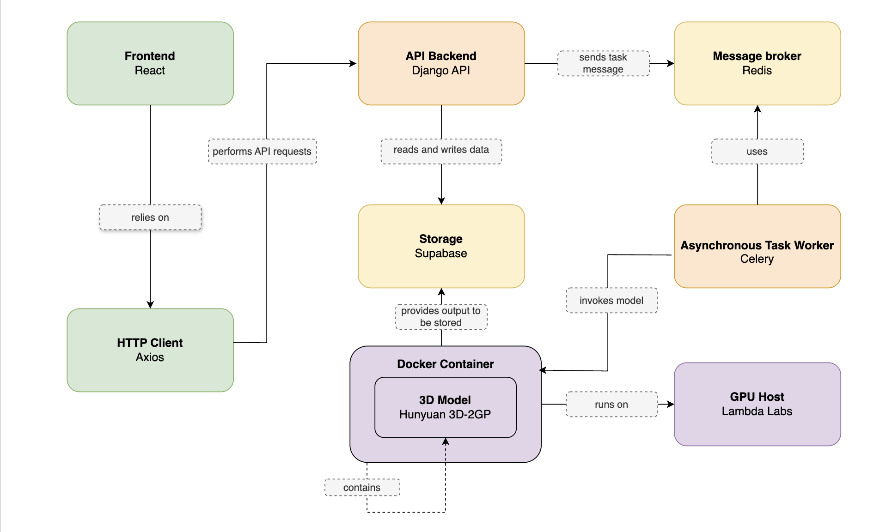

# AI Assisted Design: 2D to 3D Reconstruction for Rapid Prototyping

A web-based platform that transforms 2D images into high-quality 3D models using state-of-the-art AI reconstruction techniques. The system employs asynchronous processing architecture to handle computationally intensive 3D generation tasks while providing real-time status updates to users.

## 🎬 Platform Demonstration

https://github.com/user-attachments/assets/abdfa13a-9107-42b3-bb2d-cf56443c4948

*Complete end-to-end demonstration of the 2D to 3D reconstruction workflow*



The platform implements a distributed microservices architecture with asynchronous task processing:
- **Frontend Client** (React) interfaces with **Django REST API Backend**
- **Backend API** queues processing tasks via **Redis Message Broker**
- **Celery Worker** executes AI inference in **containerized GPU environment**
- **Persistent Storage** (Supabase) maintains generated models and metadata

## 🌐 Production Deployment

| Component | Platform | Technology Stack |
|-----------|----------|------------------|
| **Frontend** | [Netlify](https://tesi2025.netlify.app) | React, TypeScript, Three.js, Tailwind CSS |
| **Backend + Redis** | [Railway](https://railway.app) | Django REST API, Redis Queue |
| **Celery Worker** | GPU Cloud Instance | Docker, PyTorch, Diffusers |

## ⚡ GPU Worker Configuration

The Celery worker requires dedicated GPU infrastructure for AI model inference due to computational complexity. The worker operates within a Docker container to ensure dependency isolation and reproducible environments.

### 🚀 Deployment Instructions

**Prerequisites:**
- GPU-enabled cloud instance (recommended: [Lambda Labs](https://lambda.ai))
- CUDA-compatible hardware with 8GB+ VRAM
- SSH access to target instance

**Setup Process:**

1. **Establish SSH connection to your GPU cloud instance**
2. **Execute the automated bootstrap script:**

```bash
#!/bin/bash
# Automated ThesisProject deployment script
log() { echo "[$(date '+%H:%M:%S')] $1"; }

log "🚀 Initializing ThesisProject deployment..."
log "📍 Working directory: $(pwd)"

# Environment cleanup
log "🧹 Cleaning existing environment..."
rm -rf ThesisProject Hunyuan3D-2GP venv_lambda
sudo docker stop $(sudo docker ps -aq) 2>/dev/null || true
sudo docker rm $(sudo docker ps -aq) 2>/dev/null || true

# Repository cloning and setup
log "📥 Cloning repository and configuring environment..."
git clone https://github.com/MatteoPostiferi999/ThesisProject.git
cd ThesisProject/scripts/lambda-ai
chmod +x setup_celery_worker.sh
./setup_celery_worker.sh

# System validation
log "🧪 Validating system deployment..."
sleep 5
sudo docker exec celery-worker python3 -c "import onnxruntime; print('✅ System operational')" && log "✅ Deployment successful" || log "❌ Deployment failed"

log "🎉 Deployment completed successfully"
log "📍 Project location: $(pwd | sed 's|/scripts/lambda-ai||')"
log "📊 Monitor logs: sudo docker compose -f docker-compose.celery.yml logs -f celery-worker"
log "🎯 Platform URL: https://tesi2025.netlify.app"

# Initialize log monitoring
sudo docker compose -f docker-compose.celery.yml logs --tail=20 -f celery-worker
```

### 🔧 Architecture Design Rationale

**Dual-Script Architecture:**
- **Bootstrap Script**: Lightweight initialization script for rapid deployment and environment preparation
- **Setup Script**: Version-controlled configuration (`setup_celery_worker.sh`) containing complex Docker orchestration and AI model initialization

This design ensures that complex deployment logic remains version-controlled while maintaining deployment simplicity through automated bootstrapping.

## 🎯 Platform Usage

1. Access the platform at [https://tesi2025.netlify.app](https://tesi2025.netlify.app)
2. Complete user registration and authentication
3. Select appropriate AI reconstruction model
4. Upload source image (supported formats: PNG, JPG)
5. Monitor real-time processing status and queue position
6. Download generated 3D model (OBJ format)

## 🛠️ Technology Stack

**Frontend Architecture:**
- React with TypeScript for type-safe development
- Three.js for interactive 3D model visualization
- Tailwind CSS for responsive design framework

**Backend Infrastructure:**
- Django REST Framework for API development
- Celery distributed task queue for asynchronous processing
- Redis message broker for task coordination

**AI/ML Components:**
- Hunyuan3D DiT v2 reconstruction model
- PyTorch deep learning framework
- Diffusers pipeline library for model inference

**Cloud Infrastructure:**
- Netlify for frontend hosting and CDN
- Railway for backend API and Redis services
- GPU cloud providers for intensive compute workloads

## 📋 System Requirements

**GPU Instance Specifications:**
- **VRAM**: 8GB minimum (Tesla T4/V100/A10G recommended)
- **System Memory**: 16GB+ RAM for model loading and processing
- **Storage**: 20GB+ available space for AI models and dependencies
- **Network**: Stable high-bandwidth connection to Railway backend

**Supported Platforms:**
- Linux-based GPU instances (Ubuntu 20.04+ recommended)
- CUDA 11.8+ compatible hardware
- Docker Engine 20.10+ for containerization

---

**Note**: GPU instances are activated on-demand for cost optimization. Complete worker deployment is automated through the provided bootstrap script, requiring minimal manual intervention.